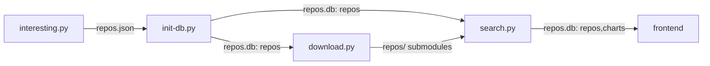

# k8s at home search (unofficial)
Search Flux HelmReleases through [awesome k8s-at-home](https://github.com/k8s-at-home/awesome-home-kubernetes) projects, check it out at https://whazor.github.io/k8s-at-home-search/. We index Flux HelmReleases from Github repositories with the [k8s-at-home topic](https://github.com/topics/k8s-at-home). To include your repository in this search it must be public and then add the topic k8s-at-home to your GitHub Repository topics. To learn more visit [the website from k8s@home](https://k8s-at-home.com/).

Thanks to Toboshii and [Hajimari](https://github.com/toboshii/hajimari) for regulating icons to helm charts.

And also thanks to k8s@home community for great charts and configurations.


## development
Overview:


**To build repos.db (optional for frontend, check step below)**

Python requirements: `pip install -r requirements.txt`

Updating `repos.json` (can be skipped, already included in source):
```
python3 interesting.py
```

Setting up `repos.db` repos table (requires `repos.json`):
```
python3 init-db.py
```

Download repos into `repos/` (requires repo.db):
```
python3 download.py
```

Setting up `repos.db` charts table:
```
python3 search.py
```

**Setting up the frontend**

```
mkdir -p frontend/public/
wget https://github.com/sql-js/sql.js/releases/download/v1.6.2/sqljs-worker-wasm.zip
unzip sqljs-worker-wasm.zip -d frontend/public/

wget https://github.com/Whazor/k8s-at-home-search/releases/latest/download/repos.db
cp repos.db frontend/public/

cd frontend/
yarn install
yarn run dev
```

### tables

**repo**
| **column name** | repo_name        | url                                | branch          | stars   |
|-----------------|------------------|------------------------------------|-----------------|---------|
| **value**       | text primary key | text                               | text            | integer |
| **example**     | user-reponame    | "https://github.com/user/reponame" | main/master/... | 42      |

**flux_helm_release**
| **column name** | chart_name | repo_name     | url                                                                 | hajimari_icon | timestamp  |
|-----------------|------------|---------------|---------------------------------------------------------------------|---------------|------------|
| **value**       | text       | text          | text                                                                | text null     | integer    |
| **example**     | plex       | user-reponame | "https://github.com/user/reponame/.../../traefik/helm-release.yaml" | tv            | 1644404532 |
